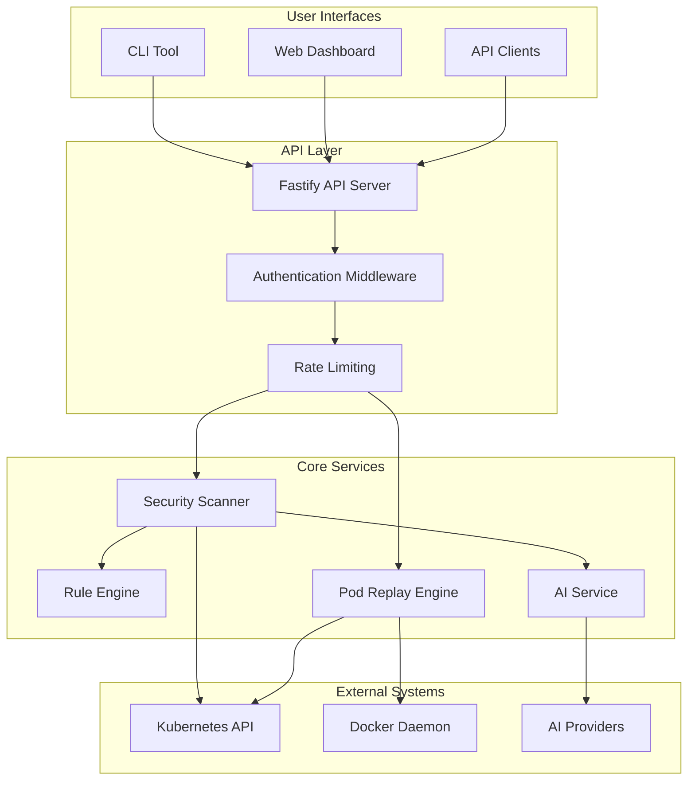

# KubeKavach Architecture Analysis

## Executive Summary

KubeKavach is a comprehensive Kubernetes security scanner with local pod replay capabilities. The system follows a modular monorepo architecture built on Node.js/TypeScript, providing security scanning, AI-powered remediation, REST API services, web dashboard, and local debugging capabilities.

## System Overview

### Core Concept
KubeKavach addresses two primary use cases:
1. **Security Scanning**: Identify vulnerabilities and misconfigurations in Kubernetes clusters
2. **Local Pod Replay**: Debug production pods locally using Docker containers

### Key Features
- 9 built-in security rules covering critical attack vectors
- Multi-provider AI integration (OpenAI, Anthropic, Google AI, Ollama)
- REST API with role-based access control
- Modern web dashboard built with SvelteKit
- Local pod debugging with Docker integration
- Extensible rule engine architecture

## Architecture Components

### 1. Monorepo Structure

```
kubekavach/
├── packages/
│   ├── core/           # Shared types, utilities, and configurations
│   ├── cli/            # Command-line interface using OCLIF
│   ├── api/            # REST API server using Fastify
│   ├── rules/          # Security rule engine
│   ├── replay/         # Pod replay functionality
│   ├── ai/             # AI provider integrations
│   └── ui/             # Web dashboard using SvelteKit
├── deployment/         # Kubernetes deployment manifests
├── helm/              # Helm charts
└── docs/              # Documentation
```

### 2. Technology Stack

#### Backend Technologies
- **Runtime**: Node.js 18+ with TypeScript 5.3+
- **Package Manager**: PNPM with workspace configuration
- **Build System**: Turbo (monorepo build orchestration) + TSUP (TypeScript bundler)
- **API Framework**: Fastify 4.x with plugins for CORS, Helmet, Swagger
- **CLI Framework**: OCLIF 3.x for command-line interface
- **Kubernetes Client**: @kubernetes/client-node for K8s API interactions
- **Container Runtime**: Dockerode for Docker integration
- **Validation**: Zod for runtime type validation

#### Frontend Technologies
- **Framework**: SvelteKit 2.x with Svelte 4.x
- **Styling**: TailwindCSS 3.x with Autoprefixer
- **Build Tool**: Vite 5.x
- **Charts**: Chart.js 4.x for data visualization
- **Date Handling**: date-fns for date formatting

#### AI Integration
- **OpenAI**: Official OpenAI SDK for GPT models
- **Anthropic**: Anthropic SDK for Claude models
- **Google AI**: Google Generative AI SDK for Gemini
- **Ollama**: Local LLM integration for on-premise deployments

#### Development & DevOps
- **Testing**: Vitest for unit testing
- **Linting**: ESLint with TypeScript support
- **Formatting**: Prettier with Svelte plugin
- **Git Hooks**: Husky + lint-staged
- **Container**: Multi-stage Docker builds with Alpine Linux
- **Orchestration**: Docker Compose and Kubernetes manifests

### 3. Data Flow Architecture



### 4. Component Interactions

#### Security Scanning Flow
1. **Initiation**: User triggers scan via CLI, API, or Web UI
2. **Authentication**: API validates user credentials and permissions
3. **Resource Fetching**: Scanner connects to Kubernetes API to retrieve resources
4. **Rule Execution**: Security rules validate each resource against defined criteria
5. **Finding Generation**: Failed validations generate structured findings
6. **AI Enhancement**: Optional AI analysis provides remediation suggestions
7. **Result Aggregation**: Findings are summarized and stored
8. **Response Delivery**: Results returned to user interface

#### Pod Replay Flow
1. **Pod Selection**: User specifies pod to replay
2. **Specification Retrieval**: System fetches pod configuration from Kubernetes
3. **Sanitization**: Pod spec is cleaned (secrets handling, service account removal)
4. **Image Analysis**: Optional security scanning of container images
5. **Container Creation**: Docker container created with sanitized configuration
6. **Environment Setup**: Container environment configured with appropriate limitations
7. **Execution**: Container started for local debugging

### 5. Security Architecture

#### Authentication & Authorization
- **API Key-based Authentication**: Secure API keys for system access
- **Role-based Access Control**: User roles (admin, scanner, viewer)
- **Secure Configuration**: Configuration files with restrictive permissions (600)

#### Security Measures
- **Helmet Integration**: Security headers for web requests
- **CORS Configuration**: Cross-origin resource sharing controls
- **Rate Limiting**: Request throttling to prevent abuse
- **Input Validation**: Zod schemas for runtime validation
- **Secret Handling**: Configurable strategies for sensitive information

#### Compliance Features
- **Indian Regulatory Compliance**: CERT-IN and MeitY compliance features
- **Audit Logging**: Comprehensive logging for security events
- **Data Retention**: Configurable retention policies

### 6. Rule Engine Architecture

#### Rule Structure
```typescript
interface Rule {
  id: string;           // Unique identifier (e.g., KKR001)
  name: string;         // Human-readable name
  description: string;  // Detailed description
  severity: Severity;   // CRITICAL, HIGH, MEDIUM, LOW
  category: string;     // Rule category
  validate: (manifest: any) => boolean;    // Validation logic
  getFinding: (manifest: any) => Finding; // Finding generator
}
```

#### Built-in Security Rules
| Rule ID | Name | Severity | Category |
|---------|------|----------|----------|
| KKR001 | Privileged Container | CRITICAL | Pod Security |
| KKR002 | Missing Resource Limits | MEDIUM | Resource Management |
| KKR003 | Allow Privilege Escalation | HIGH | Pod Security |
| KKR004 | Host Network Access | HIGH | Network Security |
| KKR005 | Host Port Binding | MEDIUM | Network Security |
| KKR006 | Read-Only Root Filesystem | MEDIUM | Container Security |
| KKR007 | Service Account Token Auto-Mount | MEDIUM | RBAC |
| KKR008 | Run as Non-Root User | HIGH | Container Security |
| KKR009 | Excessive Capabilities | HIGH | Container Security |

#### Rule Categories
- **Pod Security**: Container privilege and security context rules
- **Network Security**: Network policies and host access rules
- **RBAC**: Role-based access control and service account rules
- **Container Security**: Container configuration and runtime security
- **Resource Management**: CPU, memory, and resource quota rules

### 7. Configuration Management

#### Configuration Schema
```yaml
# ~/.kubekavach/config.yaml
kubeconfig: ~/.kube/config

api:
  port: 3000
  host: localhost
  corsOrigin: "http://localhost:5173"
  rateLimit:
    max: 1000
    timeWindow: "1 minute"

users:
  - username: admin
    apiKey: "secure-api-key"
    roles: ["admin", "scanner", "viewer"]

ai:
  provider: openai
  apiKey: "ai-provider-key"
  model: "gpt-4"

replay:
  secretHandling: prompt  # prompt | placeholder

rules:
  enabled:
    - KKR001
    - KKR002
    # ... additional rules
```

#### Environment Variable Support
- `KUBEKAVACH_API_KEY`: API authentication key
- `KUBEKAVACH_AI_API_KEY`: AI provider API key
- `KUBEKAVACH_AI_PROVIDER`: AI provider selection
- `KUBEKAVACH_KUBECONFIG_PATH`: Kubernetes configuration path

### 8. Deployment Patterns

#### Development Deployment
```bash
# Local development
npm install
npm run dev

# CLI usage
kubekavach scan -n production
kubekavach replay -n production -p my-pod
kubekavach api  # Start API server
```

#### Container Deployment
```dockerfile
# Multi-stage build
FROM node:20-alpine AS base
# ... build stages
FROM node:20-alpine AS runner
# ... production runtime
```

#### Kubernetes Deployment
- Helm charts for production deployment
- Kubernetes manifests with RBAC configuration
- Service account with minimal required permissions
- Network policies for secure communication

#### Docker Compose Deployment
- API server container
- Web UI container
- Redis for caching (optional)
- Volume mounts for kubeconfig access

### 9. Integration Patterns

#### Kubernetes Integration
- **Client Library**: Official Kubernetes JavaScript client
- **API Versions**: Support for Core/v1, Apps/v1, Batch/v1 APIs
- **Resource Types**: Pods, Deployments, DaemonSets, StatefulSets, Jobs
- **Authentication**: Kubeconfig-based authentication

#### AI Provider Integration
- **Pluggable Architecture**: Support for multiple AI providers
- **Standardized Interface**: Common API for remediation generation
- **Error Handling**: Graceful fallback when AI services unavailable
- **Rate Limiting**: Respect provider API limits

#### Docker Integration
- **Docker API**: Dockerode for container management
- **Image Operations**: Pull, create, start, stop containers
- **Resource Limits**: CPU and memory constraints for replayed containers
- **Network Isolation**: Containers run in isolated networks

### 10. Data Models

#### Core Data Structures

```typescript
// Security Finding
interface Finding {
  ruleId: string;
  ruleName: string;
  severity: 'CRITICAL' | 'HIGH' | 'MEDIUM' | 'LOW';
  resource: {
    kind: string;
    name: string;
    namespace?: string;
    apiVersion: string;
  };
  message: string;
  details?: Record<string, unknown>;
  remediation?: string;
}

// Scan Result
interface ScanResult {
  id: string;
  timestamp: string;
  cluster: string;
  namespace?: string;
  duration: number;
  summary: {
    total: number;
    critical: number;
    high: number;
    medium: number;
    low: number;
  };
  findings: Finding[];
}

// User Configuration
interface User {
  username: string;
  apiKey: string;
  roles: string[];
}
```

### 11. Error Handling & Observability

#### Error Handling Strategy
- **Custom Error Classes**: Specific error types for different failure modes
- **Graceful Degradation**: Continue operation when non-critical components fail
- **User-Friendly Messages**: Clear error messages for common issues
- **Retry Logic**: Automatic retry for transient failures

#### Logging & Monitoring
- **Structured Logging**: JSON-formatted logs with Pino
- **Log Levels**: Configurable log levels (error, warn, info, debug)
- **Request Tracking**: Unique request IDs for tracing
- **Performance Metrics**: Scan duration and resource processing metrics

#### Health Checks
- **API Health Endpoint**: `/health` endpoint for monitoring
- **Kubernetes Connectivity**: Verify API server access
- **Docker Daemon Status**: Check Docker availability for replay
- **AI Provider Status**: Validate AI service connectivity

### 12. Extensibility & Customization

#### Rule Engine Extensibility
- **Plugin Architecture**: Easy addition of custom security rules
- **Rule Categories**: Organized rule grouping for better management
- **Configurable Rules**: Enable/disable rules via configuration
- **Custom Severities**: Support for organization-specific severity levels

#### AI Provider Extensibility
- **Provider Interface**: Standardized interface for new AI providers
- **Model Configuration**: Configurable models per provider
- **Prompt Customization**: Customizable prompts for remediation generation
- **Local AI Support**: Ollama integration for on-premise deployments

#### UI Customization
- **Theme Support**: Configurable color schemes and branding
- **Dashboard Widgets**: Modular dashboard components
- **Export Functionality**: Multiple format support (JSON, CSV, PDF)
- **Custom Reports**: Configurable report generation

### 13. Performance Considerations

#### Scalability
- **Async Operations**: Non-blocking operations for better throughput
- **Job Queue**: Background processing for long-running scans
- **Resource Streaming**: Efficient processing of large clusters
- **Connection Pooling**: Optimized Kubernetes API connections

#### Memory Management
- **Streaming Processing**: Process resources without loading all into memory
- **Garbage Collection**: Proper cleanup of resources and connections
- **Memory Limits**: Configurable memory constraints for containers
- **Batch Processing**: Process resources in configurable batch sizes

#### Network Optimization
- **Connection Reuse**: HTTP keep-alive for API connections
- **Compression**: Gzip compression for API responses
- **CDN Support**: Static asset optimization for web UI
- **Caching**: Redis integration for result caching

### 14. Testing Strategy

#### Test Coverage
- **Unit Tests**: Individual component testing with Vitest
- **Integration Tests**: End-to-end workflow testing
- **E2E Tests**: CLI and API endpoint testing
- **Security Tests**: Vulnerability scanning and security validation

#### Test Data Management
- **Mock Kubernetes Resources**: Test fixtures for various resource types
- **Test Clusters**: Dedicated test environments
- **CI/CD Integration**: Automated testing in build pipelines
- **Performance Testing**: Load testing for API endpoints

### 15. Future Architecture Considerations

#### Planned Enhancements
- **Policy as Code**: Integration with Open Policy Agent (OPA)
- **Compliance Frameworks**: CIS Kubernetes Benchmark, NIST, SOC2
- **Advanced AI Features**: Automated remediation execution
- **Multi-Cluster Support**: Centralized scanning across multiple clusters
- **Real-time Monitoring**: Continuous compliance monitoring

#### Scalability Improvements
- **Microservices Migration**: Potential decomposition into microservices
- **Event-Driven Architecture**: Async event processing
- **Distributed Caching**: Redis Cluster for large-scale deployments
- **Message Queues**: RabbitMQ/Kafka for job processing

## Conclusion

KubeKavach presents a well-architected, modular system for Kubernetes security scanning and debugging. The monorepo structure promotes code reuse while maintaining clear boundaries between components. The system demonstrates strong security practices, extensible design patterns, and comprehensive integration capabilities.

The architecture successfully balances functionality, security, and maintainability while providing multiple deployment options and integration patterns suitable for various organizational needs. The pluggable AI integration and extensible rule engine make it adaptable to evolving security requirements and compliance standards.